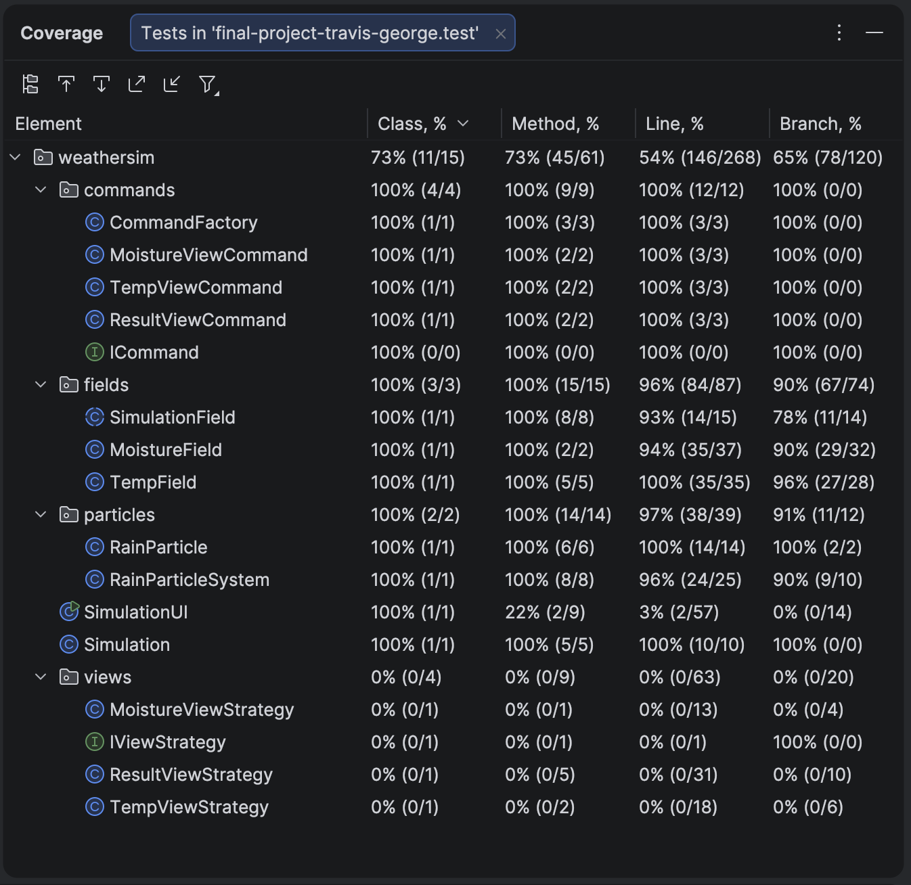

# Artificial Weather System (AWS)

**Team:** Travis Uhrig & George Fisher
**Language:** Java + Processing (Gradle, JUnit 5)
**UI:** Processing canvas

## Description

Artificial Weather System is a 2D weather sandbox built with Java and Processing. The simulation displays a side view of the sky, where the ground is on the bottom. There are three different views: temperature, moisture, result. The result view displays clouds and rain when moisture thresholds are reached. The user can only control the temperature field by painting hot or cold.

## Motivation

In this simulation, moisture forms into clouds and clouds can create rain. However, the user does not have direct control over moisture, cloud formation, or rain. Instead, all they can do is paint in temperature gradients into the sky. The rules of the simulation then control how moisture coalesses in a temperature gradient into clouds. Clouds with enough moisture spawn rain, reducing their moisture in the process. New moisture is added back into the weather system to maintain a level of humidity over time.

## Core Loop

User paints temperature -> `TempField` diffuses temperature -> `MoistureField` distributes moisture -> `ResultView` renders clouds where moisture is high -> rain falls from clouds above threshold.

## View Modes

Keyboard-switchable views let the user inspect the simulation. Views use the Strategy Pattern with each implementing `IViewStrategy`. The Command Pattern is used to switch between view strategies.

| View | Key | Strategy class |
|------|-----|----------------|
| Temperature | `t` | `TempViewStrategy` |
| Moisture | `m` | `MoistureViewStrategy` | 
| Result | `r` | `ResultViewStrategy` |

## Controls

| Key | Action |
|-----|--------|
| `r` | Switch to Result view |
| `t` | Switch to Temperature view |
| `m` | Switch to Moisture view |
| `h` | Select hot paint brush |
| `c` | Select cold paint brush |
| Mouse drag | Paint temperature when in Temperature view |

## Design Patterns

### 1. Strategy Pattern - View Rendering

The Strategy pattern is used for switching between rendering modes without putting rendering code into `SimulationUI`.

Strategies:

- `TempViewStrategy`
- `MoistureViewStrategy`
- `ResultViewStrategy`

### 2. Command Pattern - View Switching

The Command pattern is used to switch between views, with keyboard input, as command objects.

Commands:

- `TempViewCommand`
- `MoistureViewCommand`
- `ResultViewCommand`

### 3. Factory Pattern - Command Creation

`CommandFactory` creates the command objects used by `SimulationUI`.

### 4. Template Method Pattern - Simulation Updates

`SimulationField` uses a Template Method for simulation updates. The parent class defines the template with a `tick()` method calling simulation updates, while each child class provides their own simulation algorithm. `TempField` and `MoistureField` both have a `diffusion()` method, but they are different with temperature averaging and moisture moving around. `RainParticleSystem` creates particles and updates them as they fall.

Child classes:

- `TempField`
- `MoistureField`
- `RainParticleSystem`

## Test Coverage Screenshot
